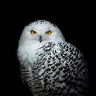

# landing-page

## Personalized mock landing page

### Objectives

In this project, I am expected to create a webpage that will show my understanding of the fundamental concepts of CSS such as the cascade, CSS rules, and the box model. This will particularly demonstrate my skills in implementing a design for a mock landing page using the flexible box layout (flexbox) module.

### Project brief

Create a webpage from the design provided below.

#### Reference image

#### Design specifications

The webpage does not have to be pixel-perfect, but it should look as close to the design as possible. It may also be personalized by adding actual images, and playing with the page's colors and fonts.

Make sure that the images are free to be used, and that the creators are credited.

### Project outcome

#### Widescreen version screenshot

#### Tablet version screenshot

#### Mobile version screenshot

#### Live link

https://cbpolitado.github.io/landing-page/

### Images used

#### White-backed vulture

["African vulture"](https://unsplash.com/photos/Pc5Yv7QX4Ts) by [Nick Kwan](https://unsplash.com/@snick_kwan) on [Unsplash](https://unsplash.com/)

#### Snowy owl

["Schnee-Eule (Snowy owl)"](https://unsplash.com/photos/vC4iux2XAho) by [Kai Wenzel](https://unsplash.com/@kai_wenzel) on [Unsplash](https://unsplash.com/)

#### Ivory-billed woodpecker

["Greenville Museum of Art 08-27-2016 - Grainger McKoy Exhibit 13 - Ivory-billed Woodpecker"](https://www.flickr.com/photos/david44149/31665479892) by [David Ellis](https://www.flickr.com/photos/david44149/) / [CC BY-NC-ND 2.0](https://creativecommons.org/licenses/by-nc-nd/2.0/) / Cropped and resized from original

#### Piping plover

["piping plover close up pirates cove june"](https://www.flickr.com/photos/russ-w/14104778058/) by [Russ](https://www.flickr.com/photos/russ-w/) / [CC BY 2.0](https://creativecommons.org/licenses/by/2.0/) / Cropped and resized from original

#### Grey parrot

["Parrot African Grey Bird"](https://www.publicdomainpictures.net/en/view-image.php?image=275786&picture=parrot-african-grey-bird) by [Karen Arnold](https://www.publicdomainpictures.net/en/browse-author.php?a=32495) / [CC0 1.0](https://creativecommons.org/publicdomain/zero/1.0/) / Cropped and resized from original